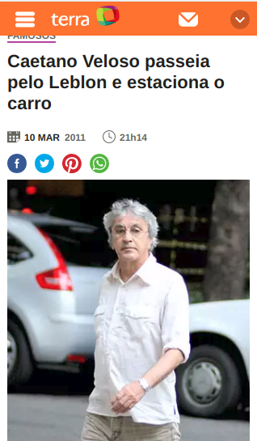
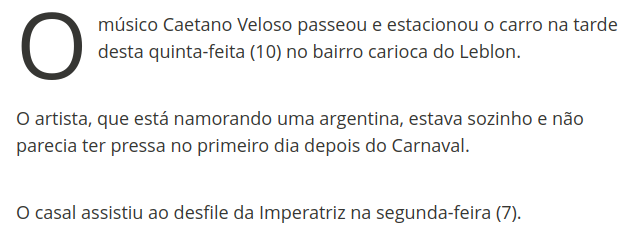
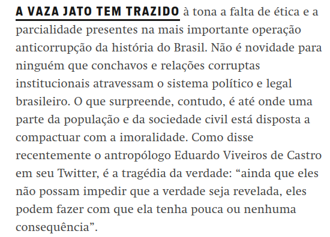
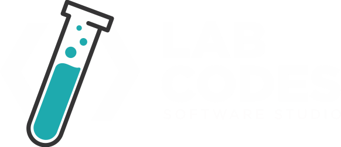

# antes de tudo...
<!-- .slide: class="bg-framed" -->

- escrever é um processo **cíclico** de **descoberta**
- **não se precisa** de um assunto **fechado** pra começar a escrever
- aqui, vamos fazer **juntos** um texto simples, de **três parágrafos**

---

# Escrever texto é muito difícil
<!-- .slide: class="bg-framed" -->

#### *-FONSECA Luan, 2019*

---

<!-- .slide: class="bg-red-pattern" data-transition-speed="fast" -->

---

# problemas mais comuns
<!-- .slide: class="bg-framed" -->

- não saber **qual** assunto abordar
- não saber **o que** falar sobre esse assunto
- não conseguir **encadear as informações**
- não saber **concluir** ou resumir

---

# qualquer coisa é notícia
<!-- .slide: class="bg-green-pattern" -->

---

# o importante é o público
<!-- .slide: class="bg-framed" -->

- **seu intuito** é conseguir **clientes**? passar conhecimento pra **juniors**? **sêniors**?
- o que você pode **dar** para seu público **em troca de sua atenção**?
- qual **frustração** que você teve e que seu público deve **querer resolver**?

---

qual o **porquê** do seu texto/palestra ->
**como** você chegou nisso ->
o **que** você quer falar

---

# tudo começa com uma frase...
<!-- .slide: class="bg-framed" -->

...e ela nem precisa ter a ver com o assunto. Por exemplo, podemos começar com uma frase que gere empatia com seu público.

---
- *Fazer deploy é chato.*
- *É 2019 e ainda tem muita gente que não usa grid nos layouts.*
- *Essa é a história de como eu descobri o Figma.*

---

# vamos juntos escrever uma frase!

---

# ...com a frase inicial,

vamos descobrir o que é um lide!

---

<!-- .slide: class="bg-framed" -->

lide

*Em jornalismo, o lide é a primeira parte de uma notícia. Geralmente o primeiro parágrafo posto em destaque, que **fornece** ao leitor **informação básica** sobre o conteúdo.*

---

# estrutura de um lide
<!-- .slide: class="bg-framed" -->

- começa-se por um **contexto**, um setup ou um resumo da notícia
- **depois**, se complementa sobre **a informação principal** do texto
- por fim, se **deixa algo** a ser completado ou **clarificado** pelo texto que segue
- o importante é deixar **claro** sobre o que vai ser dito, **sem entrar em detalhes**

---

<!-- .slide: class="bg-red-pattern" -->

---

# vamos juntos escrever um lide!

lembre-se: **não tenha medo de reescrever o que já tem**. às vezes, só descobrimos o texto ideal quando estamos acabando de escrever o texto!

---

# com o lide...
<!-- .slide: class="bg-framed" -->

*geralmente*, já temos uma boa ideia sobre o que escrever.

em um texto longo, é **nessa etapa** que **temos ideia das partes** que o texto vai ter, e **começamos a encaixar** o quebra-cabeças.

---

# escrevendo o corpo do texto
<!-- .slide: class="bg-framed" -->

- use ganchos **sem medo**
- dê espaços de **respiro**, como imagens, frases de destaque, *gifs*, subtítulos
- estabeleça um **tempo delimitado para cada parte/parágrafo**, pra não cair no perfeccionismo
- **repita**, com mais clareza, a ideia do **lide**: *contexto* -> *informação* -> *ligação*

---

# vamos juntos escrever o corpo do texto!

---

# legal, mas como a gente fecha o texto?
<!-- .slide: class="bg-red-pattern" -->

**tudo depende**, novamente, de **quem** vai consumir o texto.

---

# três grandes formatos:
<!-- .slide: class="bg-framed" -->

- recapitulação
- opinião
- referenciamento

---

# recapitulação

*Vimos hoje que o Django Rest Framework tem muitos pontos de acoplamento, mas que com uma boa estrutura de código, podemos testar tudo sem abrir mão da documentação automática. Lembre-se de separar bem a lógica de negócio do framework e testar tudo direitinho. Nos vemos por aí, até a próxima!*

---

# opinião

*O Django Rest Framework deixa muito a desejar. Os ModelSerializers, além de lentos, geram um acomplamento muito grande entre os Models e a API. Pense bem se ele é a melhor opção antes de entrar de cabeça, e cuidado com os hacks. Nos vemos por aí, até a próxima!*

---

# referenciamento

*Caso queira saber mais sobre o Django Rest Framework, leia a documentação e veja essa app Django que eu criei com os exemplos do post. Não tenha medo de falar comigo nos corredores do evento, se quiser dicas sobre casos específicos. Nos vemos por aí, até a próxima!*

---

# vamos juntos escrever uma conclusão!

---

# por fim
<!-- .slide: class="bg-framed" -->

- se dê um tempo para marcar em **bold** informações que podem ser lidas rápido
- **manter a troca** entre informação e atenção com seu leitor é **importantíssimo**
- se algo **não estiver 100%**, tente identificar **qual parte**, frase ou palavra te **gera incômodo**

---

# no pior dos casos

**comece do zero**. como tudo, escrever é **prática** e demora bastante.

precisando de ajuda, só me contatarem que a gente dá um jeito! ;)

---

# obrigado! :D
<!-- .slide: class="bg-last-slide" -->

